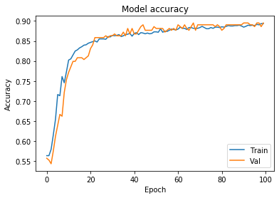

```python
# The following is a sample snippet of the initial base model
# for the rental price evaluation model for Sky View Suites.
# It does not utilize any data set related to Sky View Suites
# and does not disclose any information about Sky View Suites
# as this is a mere example of basic idea of the model.

# Author: Jin Cong Huang

# imports
import tensorflow as tf
import keras as keras
from keras import Sequential
import pandas as pd
from sklearn import preprocessing
```

    Using TensorFlow backend.


```python
# import sample data set
df = pd.read_csv('housepricedata.csv')
dataset = df.values
# print data
dataset
```


    array([[ 8450,     7,     5, ...,     0,   548,     1],
           [ 9600,     6,     8, ...,     1,   460,     1],
           [11250,     7,     5, ...,     1,   608,     1],
           ...,
           [ 9042,     7,     9, ...,     2,   252,     1],
           [ 9717,     5,     6, ...,     0,   240,     0],
           [ 9937,     5,     6, ...,     0,   276,     0]])


```python
# separate array into input and output components
X = dataset[:,0:10]
Y = dataset[:,10]
```


```python
# transform feature and scaling each feature to a given range
min_max_scaler = preprocessing.MinMaxScaler()
X_scale = min_max_scaler.fit_transform(X)
```


```python
# use train_test_split to split matrix into random train and test sub-sets
from sklearn.model_selection import train_test_split

```


```python
# using around 5 : 1 train test ratio
X_train, X_val_and_test, Y_train, Y_val_and_test = train_test_split(X_scale, Y, test_size=0.3)
X_val, X_test, Y_val, Y_test = train_test_split(X_val_and_test, Y_val_and_test, test_size=0.5)
print(X_train.shape, X_val.shape, X_test.shape, Y_train.shape, Y_val.shape, Y_test.shape)

```

    (1022, 10) (219, 10) (219, 10) (1022,) (219,) (219,)


```python
from keras.models import Sequential
from keras.layers import Dense
```


```python
# utilize keras sequential model
# rectified linear unit activation function activation for the first two layers
# sigmoid function activation for out put layer
model = Sequential([
    Dense(32, activation='relu', input_shape=(10,)),
    Dense(32, activation='relu'),
    Dense(1, activation='sigmoid'),
])

```


```python
# use simple binary_crossentropy function to evaluate true/false on above average pricing
# collect and define classification accuracy 
model.compile(optimizer='sgd',
              loss='binary_crossentropy',
              metrics=['accuracy'])
```


```python
# simple 100 epochs of training on CPU
hist = model.fit(X_train, Y_train,
          batch_size=32, epochs=100,
          validation_data=(X_val, Y_val))
```

    Train on 1022 samples, validate on 219 samples
    Epoch 1/100
    1022/1022 [==============================] - 1s 561us/step - loss: 0.6962 - acc: 0.4413 - val_loss: 0.6948 - val_acc: 0.4612
    Epoch 2/100
    1022/1022 [==============================] - 0s 79us/step - loss: 0.6901 - acc: 0.5137 - val_loss: 0.6903 - val_acc: 0.4612
    Epoch 3/100
    1022/1022 [==============================] - 0s 81us/step - loss: 0.6845 - acc: 0.5157 - val_loss: 0.6861 - val_acc: 0.4612
    Epoch 4/100
    1022/1022 [==============================] - 0s 100us/step - loss: 0.6795 - acc: 0.5176 - val_loss: 0.6821 - val_acc: 0.4749
    Epoch 5/100
    1022/1022 [==============================] - 0s 90us/step - loss: 0.6750 - acc: 0.5391 - val_loss: 0.6783 - val_acc: 0.5023
    Epoch 6/100
    1022/1022 [==============================] - 0s 82us/step - loss: 0.6706 - acc: 0.5665 - val_loss: 0.6745 - val_acc: 0.5388
    Epoch 7/100
    1022/1022 [==============================] - 0s 72us/step - loss: 0.6663 - acc: 0.6096 - val_loss: 0.6708 - val_acc: 0.5890
    Epoch 8/100
    1022/1022 [==============================] - 0s 81us/step - loss: 0.6622 - acc: 0.6712 - val_loss: 0.6672 - val_acc: 0.6256
    Epoch 9/100
    1022/1022 [==============================] - 0s 75us/step - loss: 0.6583 - acc: 0.7006 - val_loss: 0.6637 - val_acc: 0.6530
    Epoch 10/100
    1022/1022 [==============================] - 0s 85us/step - loss: 0.6545 - acc: 0.7084 - val_loss: 0.6603 - val_acc: 0.6758
    Epoch 11/100
    1022/1022 [==============================] - 0s 96us/step - loss: 0.6507 - acc: 0.7094 - val_loss: 0.6567 - val_acc: 0.6758
    Epoch 12/100
    1022/1022 [==============================] - 0s 112us/step - loss: 0.6468 - acc: 0.7299 - val_loss: 0.6530 - val_acc: 0.6804
    Epoch 13/100
    1022/1022 [==============================] - 0s 100us/step - loss: 0.6428 - acc: 0.7319 - val_loss: 0.6492 - val_acc: 0.6941
    Epoch 14/100
    1022/1022 [==============================] - 0s 90us/step - loss: 0.6385 - acc: 0.7515 - val_loss: 0.6455 - val_acc: 0.7078
    Epoch 15/100
    1022/1022 [==============================] - 0s 77us/step - loss: 0.6343 - acc: 0.7573 - val_loss: 0.6416 - val_acc: 0.7123
    Epoch 16/100
    1022/1022 [==============================] - 0s 76us/step - loss: 0.6297 - acc: 0.7603 - val_loss: 0.6374 - val_acc: 0.7078
    Epoch 17/100
    1022/1022 [==============================] - 0s 108us/step - loss: 0.6250 - acc: 0.7681 - val_loss: 0.6330 - val_acc: 0.7123
    Epoch 18/100
    1022/1022 [==============================] - 0s 120us/step - loss: 0.6200 - acc: 0.7720 - val_loss: 0.6282 - val_acc: 0.7352
    Epoch 19/100
    1022/1022 [==============================] - 0s 90us/step - loss: 0.6149 - acc: 0.7994 - val_loss: 0.6237 - val_acc: 0.7352
    Epoch 20/100
    1022/1022 [==============================] - 0s 83us/step - loss: 0.6095 - acc: 0.8043 - val_loss: 0.6188 - val_acc: 0.7443
    Epoch 21/100
    1022/1022 [==============================] - 0s 142us/step - loss: 0.6039 - acc: 0.7984 - val_loss: 0.6131 - val_acc: 0.7671
    Epoch 22/100
    1022/1022 [==============================] - 0s 89us/step - loss: 0.5981 - acc: 0.8082 - val_loss: 0.6075 - val_acc: 0.7763
    Epoch 23/100
    1022/1022 [==============================] - 0s 193us/step - loss: 0.5919 - acc: 0.8170 - val_loss: 0.6018 - val_acc: 0.7763
    Epoch 24/100
    1022/1022 [==============================] - 0s 171us/step - loss: 0.5854 - acc: 0.8200 - val_loss: 0.5956 - val_acc: 0.7854
    Epoch 25/100
    1022/1022 [==============================] - 0s 100us/step - loss: 0.5788 - acc: 0.8209 - val_loss: 0.5891 - val_acc: 0.7900
    Epoch 26/100
    1022/1022 [==============================] - 0s 99us/step - loss: 0.5721 - acc: 0.8249 - val_loss: 0.5829 - val_acc: 0.7900
    Epoch 27/100
    1022/1022 [==============================] - 0s 80us/step - loss: 0.5652 - acc: 0.8258 - val_loss: 0.5761 - val_acc: 0.7945
    Epoch 28/100
    1022/1022 [==============================] - 0s 84us/step - loss: 0.5581 - acc: 0.8219 - val_loss: 0.5692 - val_acc: 0.7991
    Epoch 29/100
    1022/1022 [==============================] - 0s 96us/step - loss: 0.5506 - acc: 0.8239 - val_loss: 0.5621 - val_acc: 0.8037
    Epoch 30/100
    1022/1022 [==============================] - 0s 79us/step - loss: 0.5433 - acc: 0.8346 - val_loss: 0.5558 - val_acc: 0.8037
    Epoch 31/100
    1022/1022 [==============================] - 0s 101us/step - loss: 0.5359 - acc: 0.8327 - val_loss: 0.5487 - val_acc: 0.8128
    Epoch 32/100
    1022/1022 [==============================] - 0s 95us/step - loss: 0.5281 - acc: 0.8346 - val_loss: 0.5404 - val_acc: 0.8265
    Epoch 33/100
    1022/1022 [==============================] - 0s 93us/step - loss: 0.5205 - acc: 0.8415 - val_loss: 0.5329 - val_acc: 0.8311
    Epoch 34/100
    1022/1022 [==============================] - 0s 79us/step - loss: 0.5128 - acc: 0.8444 - val_loss: 0.5255 - val_acc: 0.8311
    Epoch 35/100
    1022/1022 [==============================] - 0s 68us/step - loss: 0.5049 - acc: 0.8454 - val_loss: 0.5176 - val_acc: 0.8265
    Epoch 36/100
    1022/1022 [==============================] - 0s 91us/step - loss: 0.4971 - acc: 0.8474 - val_loss: 0.5105 - val_acc: 0.8311
    Epoch 37/100
    1022/1022 [==============================] - 0s 68us/step - loss: 0.4896 - acc: 0.8503 - val_loss: 0.5022 - val_acc: 0.8265
    Epoch 38/100
    1022/1022 [==============================] - 0s 69us/step - loss: 0.4819 - acc: 0.8483 - val_loss: 0.4953 - val_acc: 0.8311
    Epoch 39/100
    1022/1022 [==============================] - 0s 71us/step - loss: 0.4745 - acc: 0.8562 - val_loss: 0.4872 - val_acc: 0.8265
    Epoch 40/100
    1022/1022 [==============================] - 0s 66us/step - loss: 0.4669 - acc: 0.8542 - val_loss: 0.4789 - val_acc: 0.8356
    Epoch 41/100
    1022/1022 [==============================] - 0s 86us/step - loss: 0.4596 - acc: 0.8542 - val_loss: 0.4718 - val_acc: 0.8356
    Epoch 42/100
    1022/1022 [==============================] - 0s 60us/step - loss: 0.4528 - acc: 0.8532 - val_loss: 0.4646 - val_acc: 0.8356
    Epoch 43/100
    1022/1022 [==============================] - 0s 67us/step - loss: 0.4456 - acc: 0.8571 - val_loss: 0.4574 - val_acc: 0.8356
    Epoch 44/100
    1022/1022 [==============================] - 0s 75us/step - loss: 0.4389 - acc: 0.8601 - val_loss: 0.4495 - val_acc: 0.8447
    Epoch 45/100
    1022/1022 [==============================] - 0s 119us/step - loss: 0.4322 - acc: 0.8562 - val_loss: 0.4442 - val_acc: 0.8493
    Epoch 46/100
    1022/1022 [==============================] - 0s 140us/step - loss: 0.4259 - acc: 0.8611 - val_loss: 0.4368 - val_acc: 0.8539
    Epoch 47/100
    1022/1022 [==============================] - 0s 64us/step - loss: 0.4196 - acc: 0.8562 - val_loss: 0.4316 - val_acc: 0.8493
    Epoch 48/100
    1022/1022 [==============================] - 0s 81us/step - loss: 0.4137 - acc: 0.8581 - val_loss: 0.4235 - val_acc: 0.8493
    Epoch 49/100
    1022/1022 [==============================] - 0s 120us/step - loss: 0.4078 - acc: 0.8611 - val_loss: 0.4181 - val_acc: 0.8539
    Epoch 50/100
    1022/1022 [==============================] - 0s 101us/step - loss: 0.4024 - acc: 0.8620 - val_loss: 0.4115 - val_acc: 0.8539
    Epoch 51/100
    1022/1022 [==============================] - 0s 84us/step - loss: 0.3968 - acc: 0.8640 - val_loss: 0.4042 - val_acc: 0.8447
    Epoch 52/100
    1022/1022 [==============================] - 0s 121us/step - loss: 0.3918 - acc: 0.8650 - val_loss: 0.3999 - val_acc: 0.8584
    Epoch 53/100
    1022/1022 [==============================] - 0s 67us/step - loss: 0.3866 - acc: 0.8650 - val_loss: 0.3940 - val_acc: 0.8539
    Epoch 54/100
    1022/1022 [==============================] - 0s 79us/step - loss: 0.3818 - acc: 0.8659 - val_loss: 0.3876 - val_acc: 0.8584
    Epoch 55/100
    1022/1022 [==============================] - 0s 100us/step - loss: 0.3770 - acc: 0.8679 - val_loss: 0.3823 - val_acc: 0.8630
    Epoch 56/100
    1022/1022 [==============================] - 0s 74us/step - loss: 0.3732 - acc: 0.8689 - val_loss: 0.3788 - val_acc: 0.8584
    Epoch 57/100
    1022/1022 [==============================] - 0s 100us/step - loss: 0.3685 - acc: 0.8669 - val_loss: 0.3745 - val_acc: 0.8630
    Epoch 58/100
    1022/1022 [==============================] - 0s 85us/step - loss: 0.3643 - acc: 0.8679 - val_loss: 0.3707 - val_acc: 0.8539
    Epoch 59/100
    1022/1022 [==============================] - 0s 92us/step - loss: 0.3601 - acc: 0.8689 - val_loss: 0.3626 - val_acc: 0.8721
    Epoch 60/100
    1022/1022 [==============================] - 0s 78us/step - loss: 0.3571 - acc: 0.8689 - val_loss: 0.3603 - val_acc: 0.8630
    Epoch 61/100
    1022/1022 [==============================] - 0s 118us/step - loss: 0.3533 - acc: 0.8689 - val_loss: 0.3554 - val_acc: 0.8721
    Epoch 62/100
    1022/1022 [==============================] - 0s 121us/step - loss: 0.3496 - acc: 0.8718 - val_loss: 0.3529 - val_acc: 0.8630
    Epoch 63/100
    1022/1022 [==============================] - 0s 64us/step - loss: 0.3466 - acc: 0.8728 - val_loss: 0.3490 - val_acc: 0.8676
    Epoch 64/100
    1022/1022 [==============================] - 0s 77us/step - loss: 0.3434 - acc: 0.8738 - val_loss: 0.3443 - val_acc: 0.8721
    Epoch 65/100
    1022/1022 [==============================] - 0s 85us/step - loss: 0.3405 - acc: 0.8728 - val_loss: 0.3416 - val_acc: 0.8721
    Epoch 66/100
    1022/1022 [==============================] - 0s 55us/step - loss: 0.3374 - acc: 0.8767 - val_loss: 0.3397 - val_acc: 0.8721
    Epoch 67/100
    1022/1022 [==============================] - 0s 58us/step - loss: 0.3349 - acc: 0.8787 - val_loss: 0.3346 - val_acc: 0.8721
    Epoch 68/100
    1022/1022 [==============================] - 0s 51us/step - loss: 0.3324 - acc: 0.8757 - val_loss: 0.3341 - val_acc: 0.8676
    Epoch 69/100
    1022/1022 [==============================] - 0s 69us/step - loss: 0.3300 - acc: 0.8787 - val_loss: 0.3283 - val_acc: 0.8721
    Epoch 70/100
    1022/1022 [==============================] - 0s 58us/step - loss: 0.3272 - acc: 0.8777 - val_loss: 0.3281 - val_acc: 0.8676
    Epoch 71/100
    1022/1022 [==============================] - 0s 50us/step - loss: 0.3251 - acc: 0.8787 - val_loss: 0.3242 - val_acc: 0.8676
    Epoch 72/100
    1022/1022 [==============================] - 0s 70us/step - loss: 0.3233 - acc: 0.8757 - val_loss: 0.3206 - val_acc: 0.8767
    Epoch 73/100
    1022/1022 [==============================] - 0s 58us/step - loss: 0.3213 - acc: 0.8787 - val_loss: 0.3172 - val_acc: 0.8767
    Epoch 74/100
    1022/1022 [==============================] - 0s 51us/step - loss: 0.3189 - acc: 0.8777 - val_loss: 0.3156 - val_acc: 0.8721
    Epoch 75/100
    1022/1022 [==============================] - 0s 49us/step - loss: 0.3172 - acc: 0.8826 - val_loss: 0.3127 - val_acc: 0.8767
    Epoch 76/100
    1022/1022 [==============================] - 0s 55us/step - loss: 0.3149 - acc: 0.8796 - val_loss: 0.3087 - val_acc: 0.8721
    Epoch 77/100
    1022/1022 [==============================] - 0s 50us/step - loss: 0.3137 - acc: 0.8826 - val_loss: 0.3089 - val_acc: 0.8676
    Epoch 78/100
    1022/1022 [==============================] - 0s 87us/step - loss: 0.3117 - acc: 0.8816 - val_loss: 0.3061 - val_acc: 0.8721
    Epoch 79/100
    1022/1022 [==============================] - 0s 59us/step - loss: 0.3104 - acc: 0.8806 - val_loss: 0.3081 - val_acc: 0.8813
    Epoch 80/100
    1022/1022 [==============================] - 0s 52us/step - loss: 0.3088 - acc: 0.8836 - val_loss: 0.3025 - val_acc: 0.8721
    Epoch 81/100
    1022/1022 [==============================] - 0s 50us/step - loss: 0.3071 - acc: 0.8855 - val_loss: 0.2992 - val_acc: 0.8721
    Epoch 82/100
    1022/1022 [==============================] - 0s 51us/step - loss: 0.3060 - acc: 0.8816 - val_loss: 0.2984 - val_acc: 0.8676
    Epoch 83/100
    1022/1022 [==============================] - 0s 91us/step - loss: 0.3042 - acc: 0.8875 - val_loss: 0.2954 - val_acc: 0.8858
    Epoch 84/100
    1022/1022 [==============================] - 0s 136us/step - loss: 0.3032 - acc: 0.8865 - val_loss: 0.2967 - val_acc: 0.8767
    Epoch 85/100
    1022/1022 [==============================] - 0s 58us/step - loss: 0.3015 - acc: 0.8836 - val_loss: 0.2974 - val_acc: 0.8767
    Epoch 86/100
    1022/1022 [==============================] - 0s 52us/step - loss: 0.3003 - acc: 0.8875 - val_loss: 0.2915 - val_acc: 0.8767
    Epoch 87/100
    1022/1022 [==============================] - 0s 60us/step - loss: 0.2997 - acc: 0.8826 - val_loss: 0.2956 - val_acc: 0.8767
    Epoch 88/100
    1022/1022 [==============================] - 0s 59us/step - loss: 0.2989 - acc: 0.8875 - val_loss: 0.2927 - val_acc: 0.8767
    Epoch 89/100
    1022/1022 [==============================] - 0s 61us/step - loss: 0.2975 - acc: 0.8885 - val_loss: 0.2890 - val_acc: 0.8813
    Epoch 90/100
    1022/1022 [==============================] - 0s 59us/step - loss: 0.2966 - acc: 0.8875 - val_loss: 0.2904 - val_acc: 0.8767
    Epoch 91/100
    1022/1022 [==============================] - 0s 65us/step - loss: 0.2951 - acc: 0.8875 - val_loss: 0.2875 - val_acc: 0.8767
    Epoch 92/100
    1022/1022 [==============================] - 0s 55us/step - loss: 0.2946 - acc: 0.8894 - val_loss: 0.2861 - val_acc: 0.8813
    Epoch 93/100
    1022/1022 [==============================] - 0s 65us/step - loss: 0.2930 - acc: 0.8875 - val_loss: 0.2833 - val_acc: 0.8813
    Epoch 94/100
    1022/1022 [==============================] - 0s 60us/step - loss: 0.2924 - acc: 0.8855 - val_loss: 0.2837 - val_acc: 0.8858
    Epoch 95/100
    1022/1022 [==============================] - 0s 64us/step - loss: 0.2912 - acc: 0.8885 - val_loss: 0.2815 - val_acc: 0.8858
    Epoch 96/100
    1022/1022 [==============================] - 0s 54us/step - loss: 0.2904 - acc: 0.8855 - val_loss: 0.2818 - val_acc: 0.8904
    Epoch 97/100
    1022/1022 [==============================] - 0s 72us/step - loss: 0.2890 - acc: 0.8875 - val_loss: 0.2783 - val_acc: 0.8858
    Epoch 98/100
    1022/1022 [==============================] - 0s 56us/step - loss: 0.2888 - acc: 0.8875 - val_loss: 0.2781 - val_acc: 0.8858
    Epoch 99/100
    1022/1022 [==============================] - 0s 63us/step - loss: 0.2880 - acc: 0.8914 - val_loss: 0.2782 - val_acc: 0.8950
    Epoch 100/100
    1022/1022 [==============================] - 0s 63us/step - loss: 0.2875 - acc: 0.8885 - val_loss: 0.2800 - val_acc: 0.8904


```python
model.evaluate(X_test, Y_test)[1]
```

    219/219 [==============================] - 0s 81us/step


    0.8630137021683123


```python
# plot accuracy of data test for different epochs

import matplotlib.pyplot as plt
plt.plot(hist.history['loss'])
plt.plot(hist.history['val_loss'])
plt.title('Model loss')
plt.ylabel('Loss')
plt.xlabel('Epoch')
plt.legend(['Train', 'Val'], loc='upper right')
plt.show()
```


    <Figure size 640x480 with 1 Axes>


```python
plt.plot(hist.history['acc'])
plt.plot(hist.history['val_acc'])
plt.title('Model accuracy')
plt.ylabel('Accuracy')
plt.xlabel('Epoch')
plt.legend(['Train', 'Val'], loc='lower right')
plt.show()
```





```python

```
